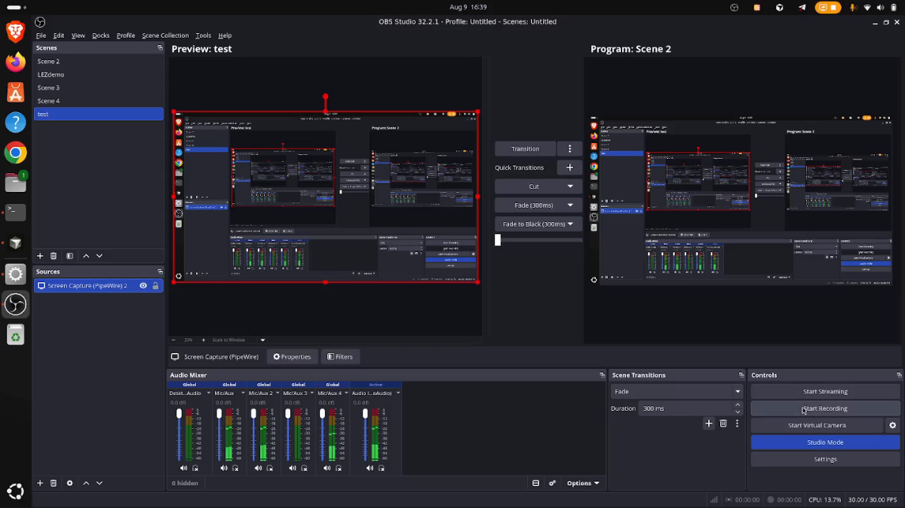

# Quorum

[](https://github.com/FidelCoder/LEZ-Quorum/actions/workflows/ci.yml)

Quorum is a private M-of-N treasury for Logos Execution Zone (LEZ). Members
approve transfers, rotations, and threshold changes without publishing the
member list or linking approvals to named members.

## Demo

[](https://cdn.jsdelivr.net/gh/FidelCoder/LEZ-Quorum@6dcfa74d2310152c04485f8fd72728a462c4e832/docs/assets/quorum-demo.mp4)

[Watch the full LEZ testnet demo (11:20, MP4)](https://cdn.jsdelivr.net/gh/FidelCoder/LEZ-Quorum@6dcfa74d2310152c04485f8fd72728a462c4e832/docs/assets/quorum-demo.mp4)

The recording shows a real-proof testnet lifecycle from an earlier network
state. That state was reset and is not current deployment evidence.

The project targets LEZ v0.2.2. It is experimental and has not received an
independent security audit.

## Public testnet

| Field | Value |
|---|---|
| RPC | `https://testnet.lez.logos.co` |
| LEZ | `v0.2.2` at `d6e4ae694e7419f5906b340c232704466a1917b7` |
| Gate program | `f84e14137c10cd3c7261f98d675ae7fcbe6cf8f8448ecd2f82dd8b7234ce98ec` |
| Deployment transaction | [`4635b013...c24b43`](https://explorer.testnet.lez.logos.co/transaction/4635b013b5d3c1b2b4f3d50af938808be839727a90bd293de2ba799b83c24b43) |
| Deployment status | Program bytecode verified at [block `693`](https://explorer.testnet.lez.logos.co/block/693) |
| Treasury status | `Executed`; approvals `2/2`, vault `500`, recipient `250` |

The fresh lifecycle was completed with real proofs on 2026-08-10. See
[Deployment](docs/DEPLOYMENT.md) for every transaction, block, account, and
verification rule.

## Protocol

1. A constitution commits the member set as one Merkle root.
2. A proposal binds its action to the constitution version.
3. Members prove credential control and Merkle membership in Risc0.
4. Proposal-bound nullifiers prevent duplicate approvals.
5. The SPEL gate enforces threshold, tier, vault, recipient, and state rules.
6. The LEZ privacy circuit authorizes private credential updates.

Private inputs include member secrets, account IDs, and Merkle paths. Public
state includes policy, proposal content, approval count, nullifiers, and
governance changes.

## Quick start

Requirements: Rust 1.91 or newer and the Risc0 3.0.5 toolchain.

```bash
cargo build -p quorum-cli
RISC0_DEV_MODE=1 ./scripts/demo.sh
```

The local flow creates a 2-of-3 treasury, executes a transfer, rotates the
member set, rejects a retired credential, and activates the replacement set.
Development receipts are not cryptographic evidence.

## LEZ lifecycle

Run the complete lifecycle against a pinned standalone LEZ v0.2.2 sequencer:

```bash
LEZ_REPO=../../logos-execution-zone-v022 ./scripts/sequencer-e2e.sh
```

The runner defaults to real proofs, owns the sequencer process, and checks the
final balances and proposal status. Use development receipts only for a fast
rehearsal:

```bash
RISC0_DEV_MODE=1 LEZ_REPO=../../logos-execution-zone-v022 \
  ./scripts/sequencer-e2e.sh
```

Success ends with `vault_balance=500`, `recipient_balance=250`,
`proposal_status=Executed`, and `RESULT=PASS`.

## Basecamp

```bash
cargo build --release -p quorum-cli
cd apps/basecamp-quorum
nix build .#generate .#lib .#lgx .#lgx-portable
```

The module provides `Local` and `LEZ Testnet` modes. Testnet submission requires
a single-use confirmation in the interface. The build produces native and
portable LGX packages.

Testnet order:

1. Select `LEZ Testnet`, then run `Check RPC` and `Prepare private state`.
2. Verify the deployed gate, preview initialization, enable the submission
   switch, and submit.
3. In `Treasury`, process each selected action from token through proposal.
   Preview, review the hash, enable submission, and submit each action.
4. Generate and submit one private approval at a time until the live threshold
   is met.
5. Refresh in `Execute`, preview and submit execution, then confirm
   `vault_balance=500`, `recipient_balance=250`, and
   `proposal_status=Executed` in `State`.

## Workspace

| Path | Purpose |
|---|---|
| `crates/quorum-core` | Treasury domain rules |
| `crates/lez-compat` | LEZ v0.2.2 account compatibility |
| `crates/quorum-circuit` | Threshold statement |
| `crates/quorum-prover` | Receipt generation and verification |
| `crates/quorum-gate-core` | Gate state and policy |
| `programs/quorum-gate` | SPEL guest and IDL |
| `crates/quorum-composer` | Private LEZ transaction composition |
| `crates/quorum-sdk` | Client API |
| `crates/quorum-cli` | Local and sequencer operator CLI |
| `apps/basecamp-quorum` | Basecamp module |

## Development

```bash
cargo fmt --all -- --check
RISC0_DEV_MODE=1 cargo clippy --workspace --all-targets --all-features -- -D warnings
RISC0_DEV_MODE=1 cargo test --workspace --all-targets --all-features -- --test-threads=1
RISC0_DEV_MODE=1 cargo run --release -p quorum-composer \
  --example compute_units
```

Generated interfaces:

```bash
./scripts/update-image-id.sh
cargo run -p quorum-gate-methods --example generate_idl
```

## Documentation

- [Architecture](docs/ARCHITECTURE.md)
- [Deployment](docs/DEPLOYMENT.md)
- [Technical reference](docs/REFERENCE.md)

## License

MIT or Apache-2.0.
