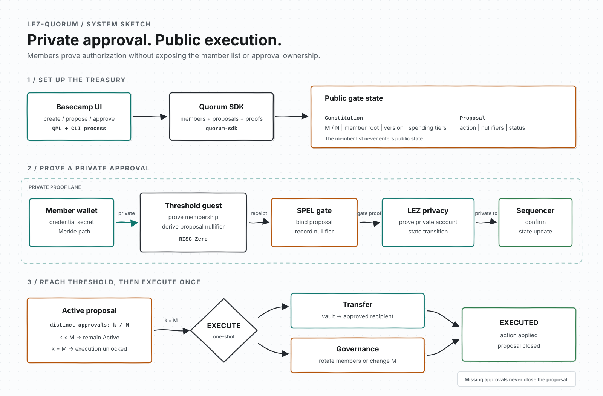

# Architecture

LEZ-Quorum is an M-of-N authorization layer for an LEZ treasury. Members stay
private; proposals, approval nullifiers, and execution results are public.

## System Sketch



The middle lane is the private approval path. `quorum-composer` attaches the
threshold receipt to the gate proof, then attaches the gate receipt to the LEZ
privacy proof.

Approval records a distinct nullifier; it does not apply the proposal. Execute
unlocks at M approvals, applies the transfer or governance change once, and
closes the proposal.

## State

| Constitution | Proposal |
|---|---|
| Multisig ID and version | Action and constitution version |
| Threshold and member count | Required threshold |
| Member root and spending tiers | Approval nullifiers |
| Proposal counter | Active or Executed status |

The constitution stores the member root, never the member list. Rotation
increments its version, making old credentials and proposals stale.

The treasury address is derived from the multisig account:

```text
vault_seed = SHA256("quorum/vault/v1" || multisig_account_id)
```

## Components

| Component | Responsibility |
|---|---|
| `quorum-core` | Member commitments, proposals, nullifiers, and policy |
| `lez-compat` | LEZ v0.2.2 account derivation and compatibility rules |
| `quorum-circuit` | Threshold statement shared by host and guest |
| `quorum-prover` | Threshold receipt generation and verification |
| `quorum-gate-core` | Gate state and deterministic validation |
| `quorum-gate` | SPEL program and generated IDL |
| `quorum-composer` | Typed lifecycle builders, proof composition, and RPC client |
| `quorum-sdk` / `quorum-cli` | Local workflow, guarded submissions, and transaction journal |
| `basecamp-quorum` | Local and testnet QML interface over an isolated CLI process |

## Privacy Boundary

| Private | Public |
|---|---|
| Member secrets and account IDs | Multisig and proposal IDs |
| Member list and Merkle paths | Member root, count, threshold, and tiers |
| Approval ownership | Approval count and nullifiers |
| Private credential state | Proposal action, status, and transfer result |

The threshold journal contains the member root, proposal binding, action,
approval count, nullifiers, and credential commitments. It contains no secret
keys, private account IDs, member list, or Merkle paths.

## Security Boundary

Security depends on SHA-256, RISC Zero receipt soundness, pinned image IDs, LEZ
account derivation, the LEZ privacy circuit, and secure credential storage.
`RISC0_DEV_MODE=1` creates test receipts only. The project is unaudited and is
not production-ready.
